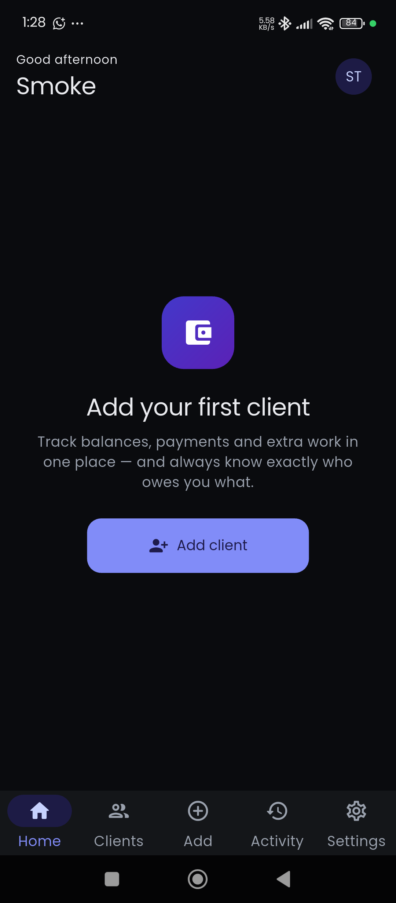
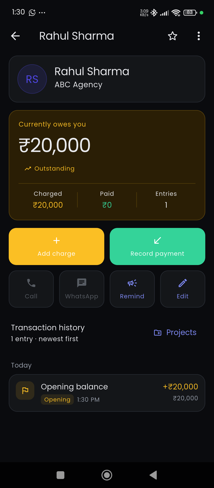
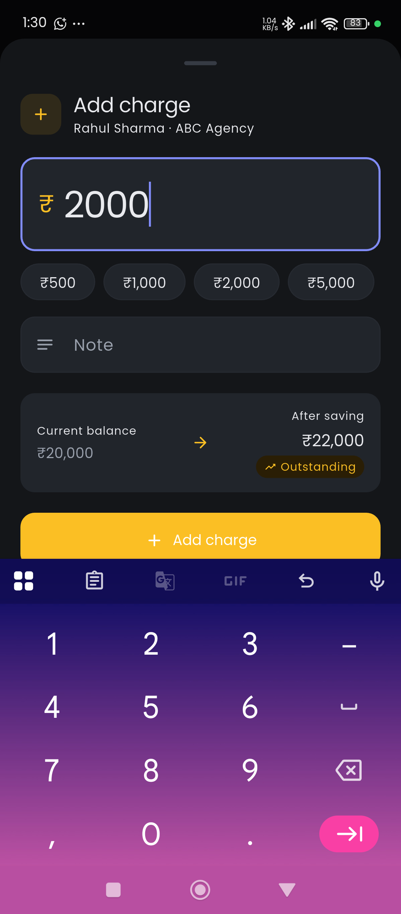
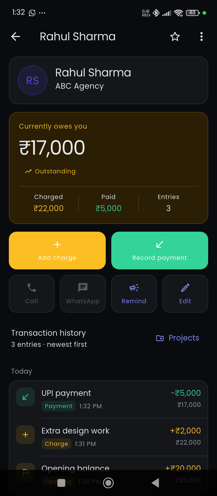
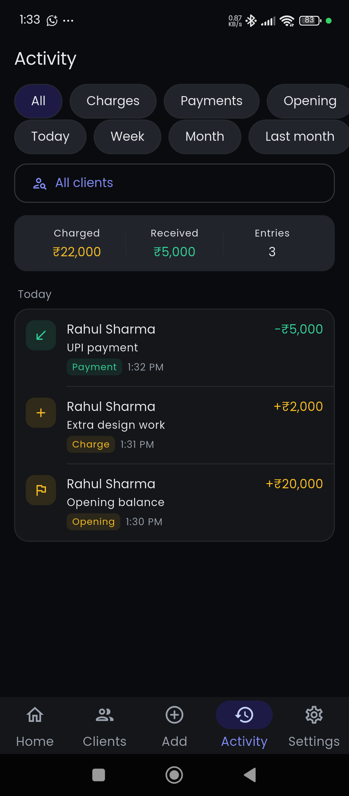
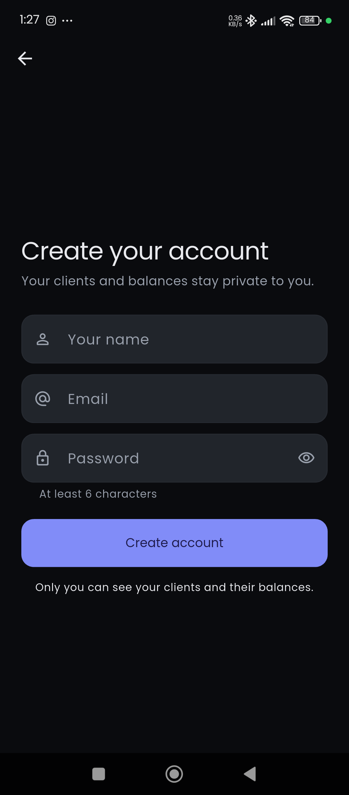

<div align="center">


# Balance Book

**Know exactly what every client owes you.**

A free, open-source client ledger for freelancers, agencies and small service
businesses. Track balances, log charges and payments, and share a live balance
page with a client, without a spreadsheet and without an accounting degree.

Built with Flutter and Firebase. Runs on Android and iOS.

[](https://flutter.dev)
[](https://dart.dev)
[](https://firebase.google.com)
[](LICENSE)
[](#testing)
[](#)

</div>

---

## The problem

If you invoice clients, the number you actually need is rarely in your invoicing
software:

> How much does **this** client owe me, right now?

Spreadsheets drift. Accounting suites want chart-of-accounts setup before they
answer anything. Balance Book does one thing: it keeps a running balance per
client, and every rupee of it is explained by a transaction you can point at.

```
Rahul Sharma                    Opening balance     + ₹20,000  →  ₹20,000
₹17,000 outstanding             Extra design work   +  ₹2,000  →  ₹22,000
                                UPI payment         −  ₹5,000  →  ₹17,000
```

---

## Screenshots

| Dashboard | Client profile | Add a charge |
|---|---|---|
|  |  |  |

| Transaction history | Activity feed | Sign up |
|---|---|---|
|  |  |  |

---

## Features

**Balances that explain themselves**
- Running balance per client, never edited by hand
- Every change is a transaction: opening, charge, payment, adjustment, reversal
- Each entry stores the balance it produced, so history reconciles line by line
- Outstanding / Settled / Credit stated in words, not just a sign

**Fast to use one-handed**
- Add a charge or record a payment in a couple of taps, with quick-amount chips
- Live before-and-after preview before you save
- Instant search by name, company, phone or email. No debounce, no round trip
- Filters for owes-me, settled, credit, recent, favourites, archived

**Client management**
- Contact details, notes, avatar colours, favourites, archiving
- **Projects** to group a client's transactions ("Website redesign", "Retainer")
- One-tap Call, WhatsApp and pre-filled payment reminders. Nothing auto-sends

**Reporting**
- Totals for today / week / month / last month / custom range
- Payments received, charges added, net movement
- Per-client lifetime charged, paid and collection rate
- CSV export for a single client statement or the whole book

**Client-facing balance page**
- Generate a private link for any client, with no account needed on their side
- Shows balance, per-project breakdown and full history
- Revocable in one tap; unguessable 24-character key; cannot be enumerated

**The rest**
- Light / dark / system theme
- Multi-currency display with correct Indian digit grouping (₹1,25,000)
- Offline reads from cache, with honest messaging about what cannot be saved
- Local follow-up reminders, with no push infrastructure required

---

## Quick start

**Prerequisites:** Flutter 3.47+ and a free Firebase project.

```bash
git clone https://github.com/balaganesansr/balance-book.git
cd balance-book
flutter pub get
```

**1. Create a Firebase project** at [console.firebase.google.com](https://console.firebase.google.com).
Enable **Authentication → Email/Password** and **Cloud Firestore** in production
mode.

**2. Generate your client config:**

```bash
dart pub global activate flutterfire_cli
flutterfire configure
```

This writes `lib/firebase_options.dart` plus the platform config files. All are
gitignored, because they belong to your project rather than to this repo. Until
they exist, the app boots to a setup screen rather than crashing.

**3. Deploy the security rules and indexes (do not skip this):**

```bash
firebase deploy --only firestore:rules,firestore:indexes
```

Firestore's defaults either lock everything out or leave everything open.
`firestore.rules` is what actually scopes data to its owner, and the composite
indexes are required by the activity feed and the reports.

**4. Run it:**

```bash
flutter run
```

<details>
<summary><b>Optional: host the client-facing balance page</b></summary>

The portal is a single static file, `public/ledger.html`. No SDK, no CDN, no
build step, just one `fetch` against one Firestore document.

1. Open `public/ledger.html` and set `projectId` and `apiKey` near the top to
   your Firebase web app's values.
2. Deploy it anywhere static:
   ```bash
   firebase deploy --only hosting
   ```
   Or drop the file into a site you already run: a Next.js `public/` folder,
   Netlify, S3, anything that serves HTML.
3. In the app: **Settings → Balance link** → set the base URL you deployed to.
4. On any client: **⋮ → Balance link → Create**.

Serve the page with `Referrer-Policy: no-referrer`. Without it, a client
clicking an outbound link leaks their share id in the `Referer` header.

</details>

---

## How it works

Every user's data lives under their own document. Ownership is the *path*, not a
filter that application code has to remember:

```
users/{uid}
 ├─ name, email, currency, paymentDetails
 └─ clients/{clientId}
     ├─ name, company, phone, currentBalance, totalCharged, totalPaid
     ├─ projects/{projectId}          grouping labels only
     └─ transactions/{transactionId}
          type, amount, delta, runningBalance, note, createdAt

publicLedgers/{shareId}               opt-in, read-only mirror for one client
```

The security rule reduces to a single comparison, so there is no path by which
one signed-in user reaches another's data:

```javascript
match /users/{uid}/... {
  allow read, write: if request.auth.uid == uid;
}
```

### Money is integer minor units

Every amount is an `int` of paise or cents. `₹2,000` is `200000`. No `double`
appears anywhere near a balance, so rounding drift is impossible. A single
utility formats and parses money; nothing else divides by 100.

### Amount and direction are separate

Each transaction stores `amount` (always positive, the number you typed) and `delta`
(the signed effect on the balance). Balances derive from `delta` alone, so the
sign of money is decided in exactly one place instead of being re-derived from a
type enum at every call site.

### Corrections preserve history

| Action | Allowed | Why |
|---|---|---|
| Edit note, method, project | Always | Descriptive only |
| Edit amount or type | **Never** | Would invalidate every running balance recorded after it |
| Reverse | Any un-reversed entry | Writes a compensating entry; both stay visible |
| Delete permanently | Newest entry only | Nothing later exists to invalidate |

Balance-changing writes run inside a Firestore transaction that reads the client
document first, so the stored balance and the ledger cannot drift apart even
with two devices writing at the same moment.

### Offline

Reads come from Firestore's cache, so the app opens and shows the last synced
figures with no connection. **Writes are blocked while offline** and the UI says
so plainly. Queuing one would mean reporting a payment as saved before it was.

---

## Architecture

```
lib/
├── core/
│   ├── theme/      design tokens, light + dark
│   ├── utils/      money, dates, CSV, contact links, safe insets
│   └── widgets/    shared primitives
├── models/         Client, AppTransaction, Project, UserProfile, Reminder
├── services/       every Firestore and Auth call lives here
├── providers/      Riverpod: streams, filters, derived totals
├── features/       one folder per screen area
└── router.dart     go_router with auth redirect and a tab shell
```

No widget imports `cloud_firestore`. Screens read a provider, providers call a
service, and only `TransactionService` writes a balance.

**Stack:** Flutter · Riverpod · go_router · Firebase Auth · Cloud Firestore ·
`intl` · `url_launcher` · `share_plus` · `flutter_local_notifications`

---

## Testing

```bash
flutter analyze          # 0 issues
flutter test             # 80 unit tests

npm --prefix firestore-tests install
firebase emulators:exec --only firestore --project demo-balance-book \
  "npm --prefix firestore-tests test"    # 49 security-rule tests
```

The rules tests matter most. They use raw SDK calls that bypass the app
entirely, and cover one user attempting to read, list, write and delete
another's clients and transactions; unauthenticated access; unscoped
collection-group queries; enumeration of the public balance pages; float
amounts; a `delta` that does not match its `amount`; back-dated timestamps; and
attempts to edit a recorded amount, type or running balance.

Unit tests cover the money formatter and parser, including a thousand-iteration
accumulation that would expose float drift, plus balance arithmetic,
date-range boundaries, CSV escaping, and the public snapshot's field allow-list.

---

## Roadmap

- [ ] Recurring charges for retainer clients
- [ ] Invoice PDF export
- [ ] Multi-device conflict surfacing
- [ ] Localisation beyond English
- [ ] Play Store and App Store releases

## Contributing

Issues and pull requests are welcome. See [CONTRIBUTING.md](CONTRIBUTING.md) for
the conventions that keep the ledger trustworthy. Chiefly: money stays integer,
only one service writes a balance, and recorded amounts are never edited.

## License

[MIT](LICENSE). Free for personal and commercial use.

---

<div align="center">

<sub>

**Topics** · flutter client ledger · firebase accounting app · freelancer
payment tracker · client balance manager · khata book alternative · udhar bahi
khata app · outstanding payments tracker · small business ledger ·
firestore security rules example · flutter riverpod firebase example ·
open source billing app · payment reminder app · INR ledger app

</sub>

</div>
